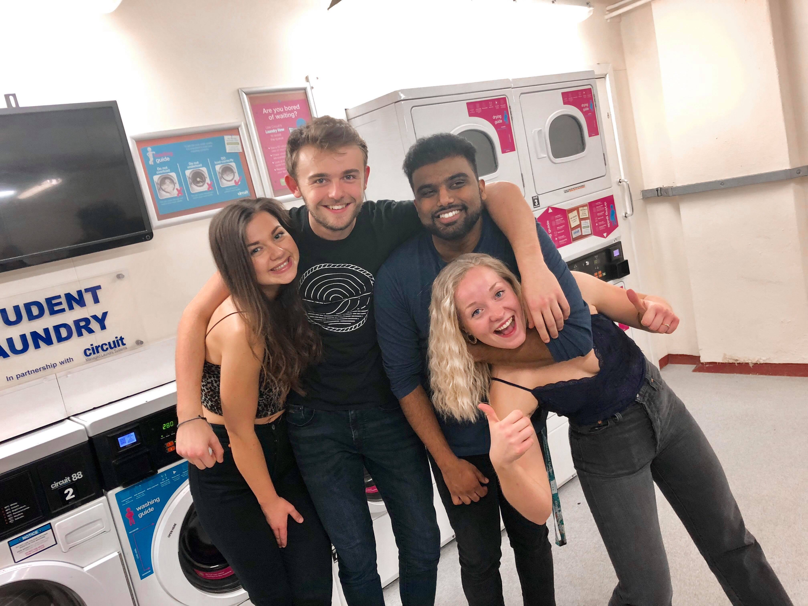
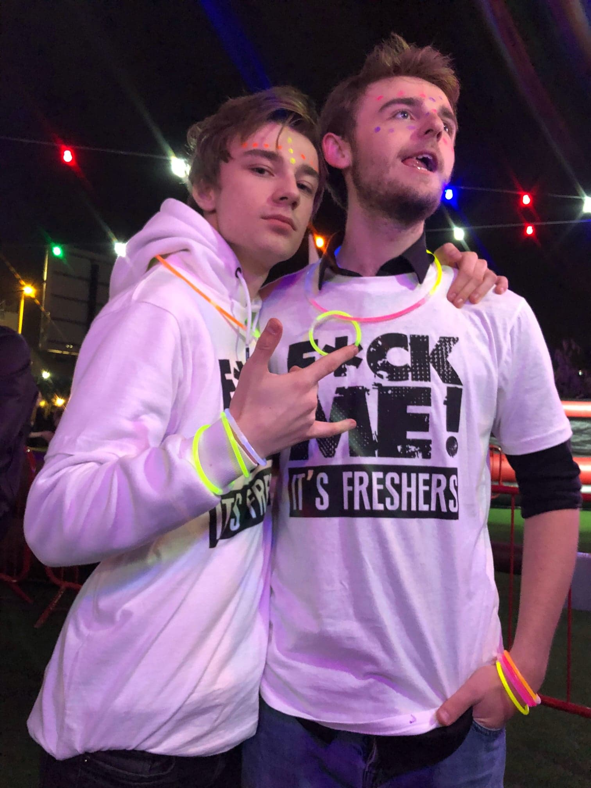

So it's coming to a close...

First year of university has wrapped up and I'm preparing to go and move into a new apartment and out of halls. It has been an experience...

I can start off by saying that I am definitely privileged to be here. Not only for the fact that I am lucky to be able to attend university where some others can't, but I am also lucky to have met some amazing people, learned a lot from them and to have had some of the best experiences of my life at City.

My overall experience with the course so far is one of confidence and excitement to engage more and develop skills. My peers will tell you that sometimes I find course content to be repetitive and some things that I have already learned play a part in mild phases of boredom during lectures. I enjoy intellectual stimulation and to be able to solve puzzles and apply skills that I would not necessarily be able to anywhere else, and with that being said, my course has helped me in achieving this, providing me with different challenges to face and overcome.

My mum actually made a really good comment about her course the other day, in that "you get out of it what you put in." I believe this to be the same for my course as with university you can take a whole new approach to your education and grasp it in a whole new light and luckily I have lecturers that are keen in helping me do so.

My Java project, where most games made were in the style of platformers, was in the form of a 2D puzzle game.
My Business Systems project, normally a basic website written with a Java backend, was done in React, MongoDB and NodeJS.

Even projects you wouldn't expect, like mathematical calculations for Operating Systems, I created an implementation in Python to work for any dataset and not just specifically for my own.

Overall I have been able to explore academic boundaries and push the limits of my knowledge and programming ability. All thanks to City University.

In addition, I do want to shout out the people that kept me sane throughout all of this.

- [Reece Mercer](https://reecemercer.dev/)
- [Piotr Rutkowski](https://github.com/PiotrRut)
- [Gawtam Tharmakumaran](https://www.instagram.com/gawtamt/)
- Marte Vingsnes
- Camilla Sunde

These guys not only made my university experience more fun that I could've possibly imagined, they helped me cope with stress and took me out for drinks whenever I needed some time away from my desk.

Here's to you guys!

Signing off,

~ J

