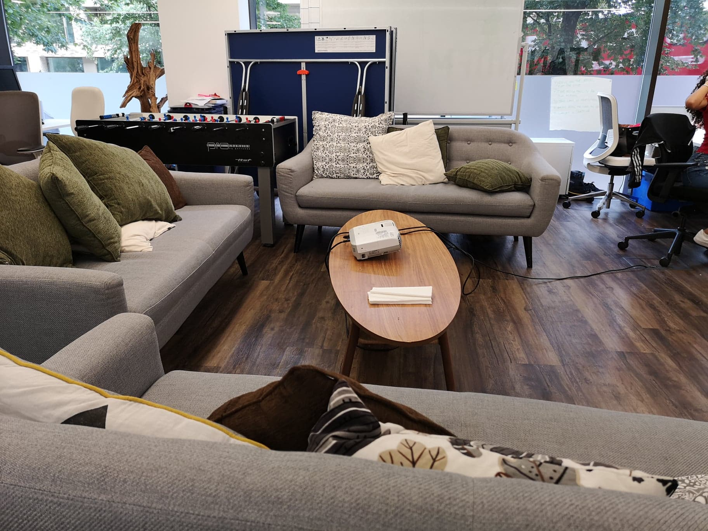
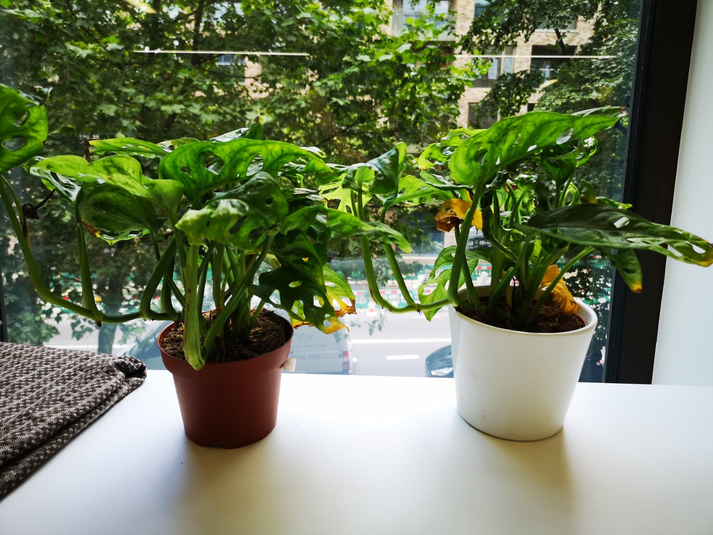
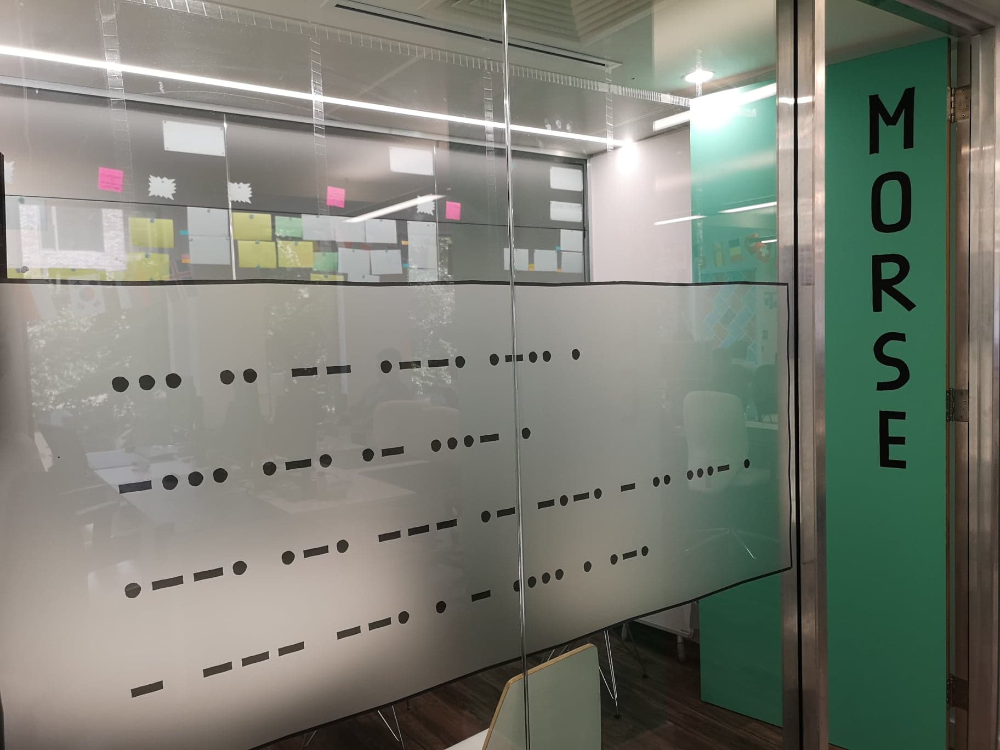
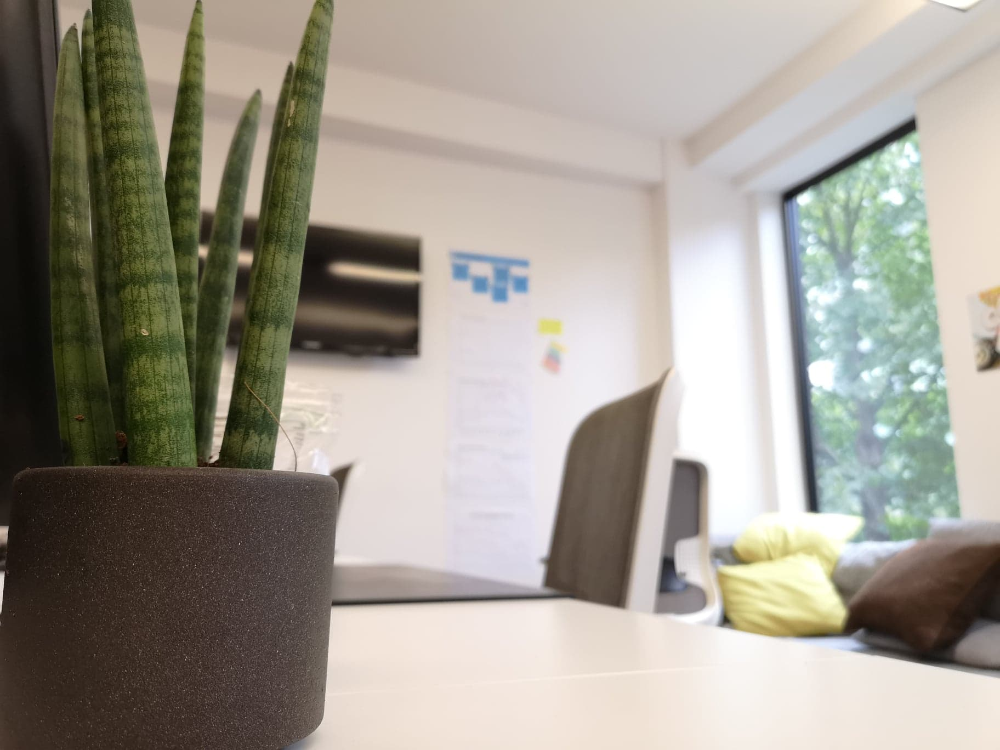
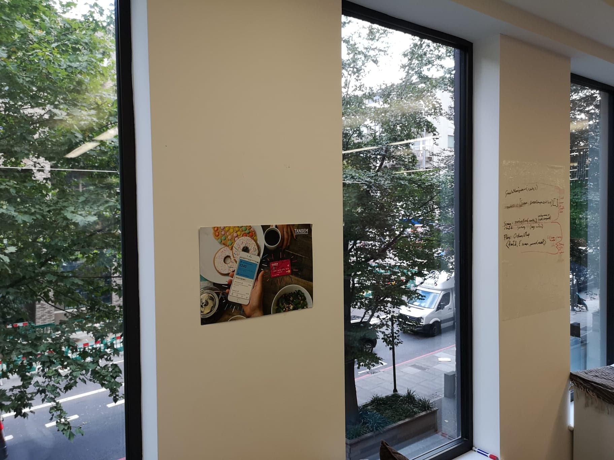
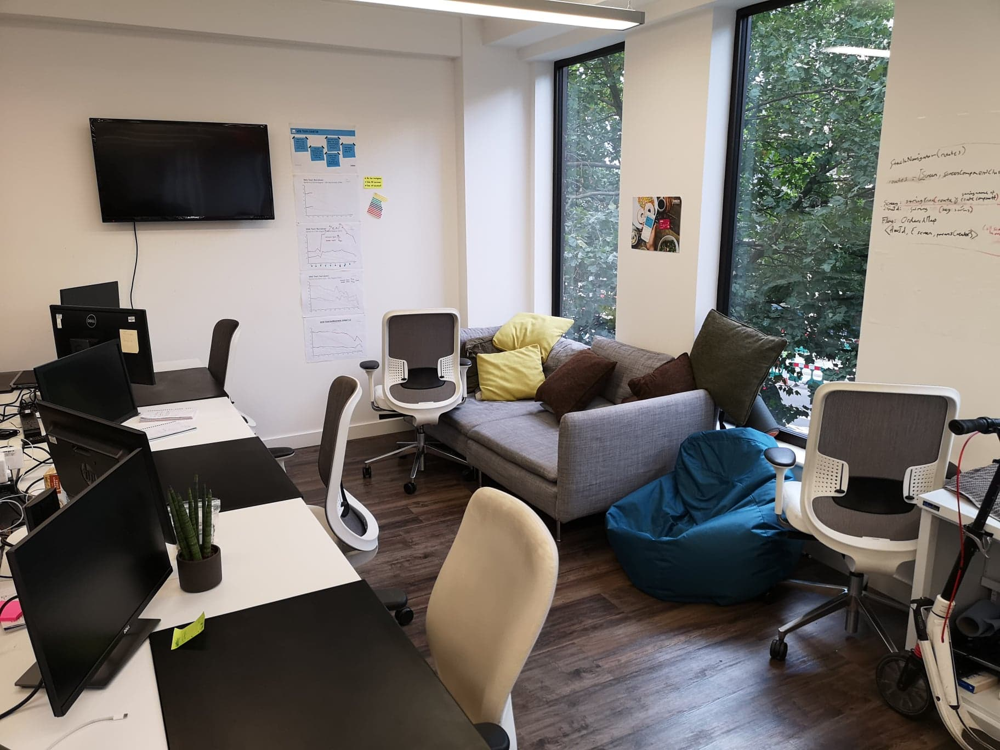

Most people see internships as the tedious, monotonous and degrading process of retrieving coffee for executives in the hope that you gain some real world experience in whichever industry you choose to pursue.

Tandem would disagree.

Tandem Bank is a fully digital bank that aims to provide an incredible customer experience for anyone that wishes to have access to all their banking processes directly on their mobile device. In short, I am one of many that believe that Tandem is the bank of the future.

I took the time to spend 3 weeks shadowing Tandem's acquisitions team and I found out that internships can be more than just fetching hot drinks for men of power while they discuss all the money they're making. It's about a caring work space, a nurturing environment and an enjoyable office that make Tandem stand above the rest of the industry as a company that truly cares what it's employees have to say.

Having been there only a few hours, I was already put to work, sat in front of a laptop and told to dig through all of the bugs, find one I liked, and fix it. This immediately made me hesitant. The thoughts rushing through my mind were: "This is too much!" and "I'm not good enough for this!" However that was until I was introduced to my team. As mentioned earlier, I worked with the acquisitions team, an immensely talented group of developers who had years of industry experience to each of them. I could not have asked for a better team. Having issues with my laptop, one of the members leant me his own so I could work while he attempted to solve some bugs in the code stopping the platform from being usable on my device. Another, consistently helped me with any issue that I had and any problems I faced trying to fix a bug, no matter how busy he was (although that being said, this was true for all members of the team). Finally, I learned some incredible things from working with this group of people that I have even put into production on this website!

Every morning Tandem encourages it's employees to have a "stand up." Where you discuss any issues or problems you're facing, as well as what you had done the day before. This was invaluable as the employees could then collaborate on any issues, pull in people from different departments to gather resources or information and generally assist one another and plan out their days. Using the Agile Project Management structure keeps employees motivated, keeps their workloads realistic and ensures that they are not being overworked and everything is organised.

Overall, Tandem's general atmosphere in-office was phenomenal, however, external to the office was even more incredible. Tandem host a Thursday get together every week, wherein different activities are organised. This could range from:

* Drinks at the local bar
* A Quiz Night
* Drinks at the CEO's home

And many others. Sadly, I only got to experience drinks at the local bar, however, that still doesn't include complaint, as the drinks were on the company account!

Tandem office as well, had an astounding feel about it. There were couches, stress balls and a basketball net just setup in my workspace. Clearly, Tandem takes excellent care of their employees. Every Friday, Tandem also hosts a lunch and learn, where food is also on the company, and a person from one sector of the business gives a presentation on one aspect of their job, so you can learn more about how the company works.

All in all, the experience was absolutely incredible, and I want to thank everyone involved again for making it one of the most unforgettable experiences I could have ever asked for!
